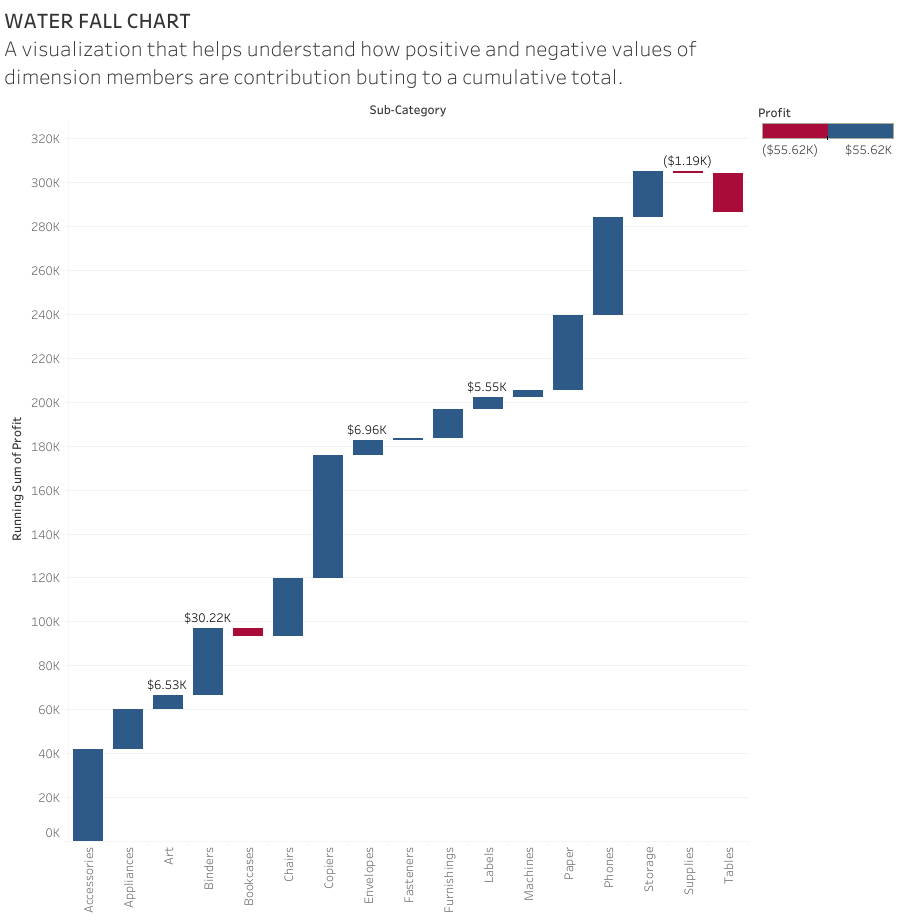

# **Learning Tableau**

## Books

1. Practical Tableau. 

In processing, Im hoping i can finish reading it first time by the end of April, 2021. 

2. Tableau for Dummies. 

Easy book introduces the basic features of tableau. Already finished. 

## Hands on practice 

[Workout Wednesday](http://www.workout-wednesday.com/)

[Learn Tableau](https://learningtableau.com/) 

## Type of charts in Tableau

### [**Water Fall Chart**](https://www.youtube.com/watch?v=q_4Y0-6xsUk&ab_channel=AnthonyB.Smoak)

A visualization that helps understand how positive and negative values of dimension members are contributing to a cumulative total. 

